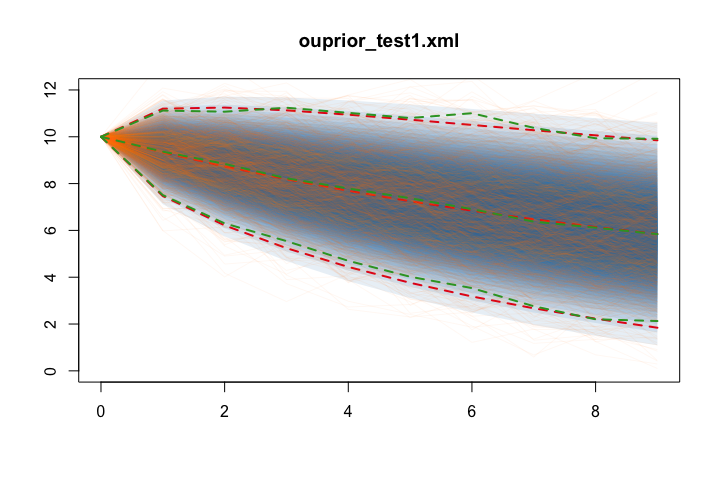
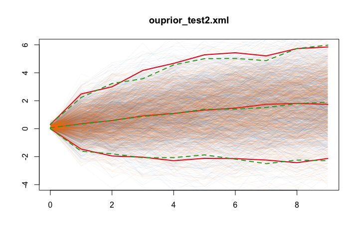
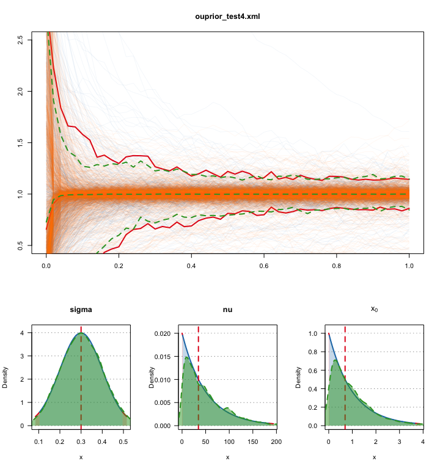
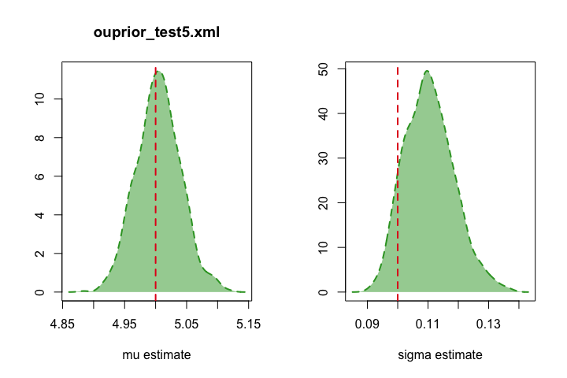

Tests to check that the OU-prior implemented in BEAST2 is correct. In particular checking that sampling trajectories in BEAST2 with MCMC produces the correct theoretical distribution as well as the same distribution as simulating trajectories using the analytical solution (when drawing parameter values from prior distributions). Additionally, also test the ability of the BEAST2 implementation to estimate parameter values given a trajectory. 


### Test 1: `ouprior_test1.xml`

- OU-process with all parameters fixed.
- Sample x using MCMC in BEAST2 and compare to theoretical quantiles.


```r
    #####################
    # ouprior_test1.xml #
    #####################
    
    # Calculate density of OU-process and get percentiles (blue and red)
    t     <- seq(0,9,by=1)
    x0    <- 10
    mu    <- 3
    sigma <- 1
    nu    <- 0.1
    X     <- plotOUProcessHPD(x0, t, mu, sigma, nu, ylim = c(0,12), main='ouprior_test1.xml', xlab="", ylab="")
    sim_hpd <- getMatrixHPD(X)
    
    # Sample from posterior in BEAST2 and get HPD (orange and green)
    lf <- readLogfile("ouprior_test1.log")
    
    xsample <- getSkylineSubset(lf,"x")
    for (i in 1:nrow(xsample)) {
      lines(t,xsample[i,],col=pal.dark(corange,0.1),lwd=0.5)
    }
    sample_hpd <- getMatrixHPD(xsample)
    lines(t,sample_hpd[1,],col=pal.dark(cgreen),lty=2,lwd=2)
    lines(t,sample_hpd[2,],col=pal.dark(cgreen),lty=2,lwd=2)
    lines(t,sample_hpd[3,],col=pal.dark(cgreen),lty=2,lwd=2)
```

<!-- -->


### Test 2: `ouprior_test2.xml`

- OU-process with all parameters fixed and x_0 sampled from an exponential prior. 
- Sample x using MCMC in BEAST2 and compare HPDs of x to 1000 simulated trajectories (using analytical solution from time-transformed Wiener process).


```r
    #####################
    # ouprior_test2.xml #
    #####################
    
    # Simulate OU-trajectory and get HPD (blue and red)
    t     <- seq(0,9,by=1)
    x0_p  <- getPrior(rexp,1,rate=10)
    mu    <- 3
    sigma <- 1
    nu    <- 0.1
    X     <- plotOUProcessHPDEmpirical(x0_p, t, mu, sigma, nu, ylim = c(-4,6), main='ouprior_test2.xml')
    sim_hpd <- getMatrixHPD(X)
    
    # Sample from posterior in BEAST2 and get HPD (orange and green)
    lf <- readLogfile("ouprior_test2.log")
    
    xsample <- getSkylineSubset(lf,"x")
    for (i in 1:nrow(xsample)) {
        lines(t,xsample[i,],col=pal.dark(corange,0.1),lwd=0.5)
    }
    sample_hpd <- getMatrixHPD(xsample)
    lines(t,sample_hpd[1,],col=pal.dark(cgreen),lty=2,lwd=2)
    lines(t,sample_hpd[2,],col=pal.dark(cgreen),lty=2,lwd=2)
    lines(t,sample_hpd[3,],col=pal.dark(cgreen),lty=2,lwd=2)
```

<!-- -->


### Test 3: `ouprior_test3.xml`

- OU-process with all parameters drawn from priors.
- Sample x using MCMC in BEAST2 and compare HPDs of x to 1000 simulated trajectories (using analytical solution from time-transformed Wiener process).
- Compare posterior distributions for parameters to priors (without data posterior should equal prior).


```r
    #####################
    # ouprior_test3.xml #
    #####################
    
    layout(matrix(c(1,1,1,1,2,3,4,5), nrow=2, byrow=TRUE), heights = c(5,3))
    
    # Simulate OU-trajectory and get HPD (blue and red)
    t       <- seq(0,0.9,by=0.1)
    x0_p    <- getPrior(runif,  1, min=1.5, max=2.5)     
    mu_p    <- getPrior(rlnorm, 1, meanlog=0, sdlog=0.5)
    sigma_p <- getPrior(rnorm,  1, mean=0.5, sd=0.1)
    nu_p    <- getPrior(rgamma, 1, shape=1, scale=5)
    X     <- plotOUProcessHPDEmpirical(x0_p, t, mu_p, sigma_p, nu_p, ylim = c(0,4), main='ouprior_test3.xml')
    sim_hpd <- getMatrixHPD(X)
    
    # Sample from posterior in BEAST2 and get HPD (orange and green)
    lf <- readLogfile("ouprior_test3.log")
    
    xsample <- getSkylineSubset(lf,"x")
    for (i in 1:nrow(xsample)) {
      lines(t,xsample[i,],col=pal.dark(corange,0.1),lwd=0.5)
    }
    sample_hpd <- getMatrixHPD(xsample)
    lines(t,sample_hpd[1,],col=pal.dark(cgreen),lty=2,lwd=2)
    lines(t,sample_hpd[2,],col=pal.dark(cgreen),lty=2,lwd=2)
    lines(t,sample_hpd[3,],col=pal.dark(cgreen),lty=2,lwd=2)
    
    # mu
    mu_density <- density(lf$mu)
    plotPrior('lnorm',list(meanlog=0, sdlog=0.5), main='mu')
    lines(mu_density$x, mu_density$y, lwd=2, lty=2, col=pal.dark(cgreen))
    polygon(c(0, mu_density$x, 0), c(0, mu_density$y, 0), col=pal.dark(cgreen,0.5), border=NA)
    
    # Sigma
    sigma_density <- density(lf$sigma)
    plotPrior('norm',list(mean=0.5, sd=0.1), main='sigma')
    lines(sigma_density$x, sigma_density$y, lwd=2, lty=2, col=pal.dark(cgreen))
    polygon(c(0, sigma_density$x, 0), c(0, sigma_density$y, 0), col=pal.dark(cgreen,0.5), border=NA)
    
    # nu
    nu_density <- density(lf$nu, bw=0.3)
    plotPrior('gamma',list(shape=1, scale=5), main='nu')
    lines(nu_density$x, nu_density$y, lwd=2, lty=2, col=pal.dark(cgreen))
    polygon(c(0, nu_density$x, 0), c(0, nu_density$y, 0), col=pal.dark(cgreen,0.5), border=NA)
    
    #x0 
    x0_density <- density(lf$x1, bw=0.05)
    plotPrior('unif',list(min=1.5, max=2.5), main=expression(x[0]))
    lines(x0_density$x, x0_density$y, lwd=2, lty=2, col=pal.dark(cgreen))
    polygon(c(0, x0_density$x, 0), c(0, x0_density$y, 0), col=pal.dark(cgreen,0.5), border=NA)
```

<!-- -->


### Test 4: `ouprior_test4.xml`

- OU-process with all parameters drawn from priors, except for the mean.
- Run for 51 time points instead of just 10 as above.
- Sample x using MCMC in BEAST2 and compare HPDs of x to 1000 simulated trajectories (using analytical solution from time-transformed Wiener process).
- Compare posterior distributions for parameters to priors (without data posterior should equal prior).


```r
    #####################
    # ouprior_test4.xml #
    #####################
    
    layout(matrix(c(1,1,1,2,3,4), nrow=2, byrow=TRUE), heights=c(5,3))
    
    # Simulate OU-trajectory and get HPD (blue and red)
    t       <- seq(0,1,length.out=51)
    x0_p    <- getPrior(rexp,  1, rate=1)     
    mu      <- 1
    sigma_p <- getPrior(rnorm,  1, mean=0.3, sd=0.1)
    nu_p    <- getPrior(rgamma, 1, shape=1, scale=50)
    X       <- plotOUProcessHPDEmpirical(x0_p, t, mu, sigma_p, nu_p, ylim = c(0.5,2.5), main='ouprior_test4.xml')
    sim_hpd <- getMatrixHPD(X)
    
    # Sample from posterior in BEAST2 and get HPD (orange and green)
    lf <- readLogfile("ouprior_test4.log")
    
    xsample <- getSkylineSubset(lf,"x")
    for (i in 1:nrow(xsample)) {
      lines(t,xsample[i,],col=pal.dark(corange,0.1),lwd=0.5)
    }
    sample_hpd <- getMatrixHPD(xsample)
    lines(t,sample_hpd[1,],col=pal.dark(cgreen),lty=2,lwd=2)
    lines(t,sample_hpd[2,],col=pal.dark(cgreen),lty=2,lwd=2)
    lines(t,sample_hpd[3,],col=pal.dark(cgreen),lty=2,lwd=2)
    
    # Sigma
    sigma_density <- density(lf$sigma)
    plotPrior('norm',list(mean=0.3, sd=0.1), main='sigma')
    lines(sigma_density$x, sigma_density$y, lwd=2, lty=2, col=pal.dark(cgreen))
    polygon(c(0, sigma_density$x, 0), c(0, sigma_density$y, 0), col=pal.dark(cgreen,0.5), border=NA)
    
    # nu
    nu_density <- density(lf$nu, bw=5)
    plotPrior('gamma',list(shape=1, scale=50), main='nu')
    lines(nu_density$x, nu_density$y, lwd=2, lty=2, col=pal.dark(cgreen))
    polygon(c(0, nu_density$x, 0), c(0, nu_density$y, 0), col=pal.dark(cgreen,0.5), border=NA)
    
    #x0 
    x0_density <- density(lf$x1)
    plotPrior('exp',list(rate=1), main=expression(x[0]))
    lines(x0_density$x, x0_density$y, lwd=2, lty=2, col=pal.dark(cgreen))
    polygon(c(0, x0_density$x, 0), c(0, x0_density$y, 0), col=pal.dark(cgreen,0.5), border=NA)
```

<!-- -->
    
    
### Test 5: `ouprior_test5.xml`

- OU-process with fixed parameters, simulate a single trajectory with 101 time points.
- Fix trajectory in BEAST2 and attempt to estimate mean and variance (mean-reversion fixed to true value).


```r
    #####################
    # ouprior_test5.xml #
    #####################
    
    set.seed(10)
    
    t     <- seq(0,10,by=0.1)
    x0    <- 6
    mu    <- 5
    sigma <- 0.1
    nu    <- 1
    x <- simulateOU(x0, t, mu, sigma, nu)
    
    #plot(t,x,type='l',col=pal.dark(cblue))
    print(paste(x,collapse = " "))
    
    # Posterior estimates in BEAST2 and get HPD (orange and green)
    lf <- readLogfile("ouprior_test5.log")
    
    par(mfrow=c(1,2))
    
    # mu
    mu_density <- density(lf$mu)
    plot(mu_density$x, mu_density$y, lwd=2, lty=2, col=pal.dark(cgreen), type='l',ylab="",xlab="mu estimate")
    polygon(c(0, mu_density$x, 0), c(0, mu_density$y, 0), col=pal.dark(cgreen,0.5), border=NA)
    abline(v=mu,lty=2,lwd=2,col=pal.dark(cred))
    title("ouprior_test5.xml")
    
    # sigma
    sigma_density <- density(lf$sigma)
    plot(sigma_density$x, sigma_density$y, lwd=2, lty=2, col=pal.dark(cgreen), type='l',ylab="",xlab="sigma estimate")
    polygon(c(0, sigma_density$x, 0), c(0, sigma_density$y, 0), col=pal.dark(cgreen,0.5), border=NA)
    abline(v=sigma,lty=2,lwd=2,col=pal.dark(cred))
```

<!-- -->
